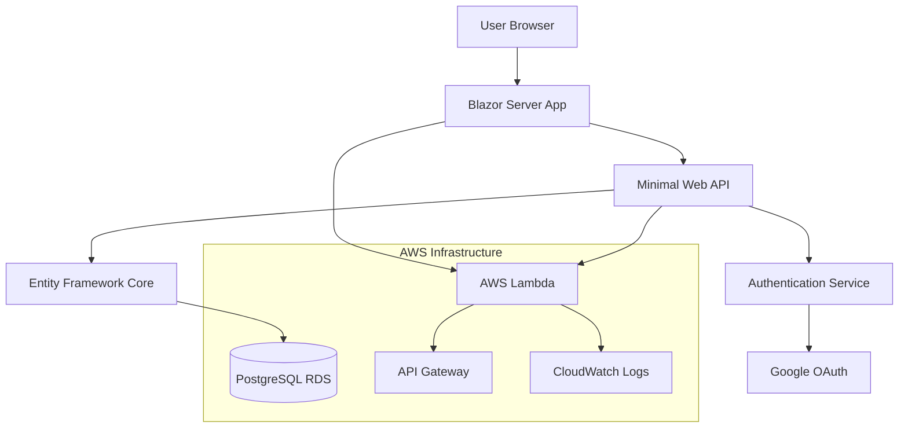

# Task Management Web Application - Architecture Design

## Overview
A full-stack task/project management web application built with C# that deploys to AWS Lambda, featuring Google OAuth authentication, PostgreSQL database, and Blazor Server frontend.

## Technology Stack

### Backend
- **Framework**: .NET 8 Minimal Web API
- **Database**: PostgreSQL (AWS RDS)
- **ORM**: Entity Framework Core
- **Authentication**: ASP.NET Core Identity with Google OAuth
- **Hosting**: AWS Lambda with API Gateway

### Frontend
- **Framework**: Blazor Server
- **UI Components**: Bootstrap 5 + custom components
- **State Management**: Built-in Blazor state management

### Infrastructure
- **Cloud Provider**: AWS
- **Database**: Amazon RDS PostgreSQL
- **Compute**: AWS Lambda
- **API Gateway**: Amazon API Gateway
- **Storage**: Amazon S3 (for static assets if needed)
- **Monitoring**: AWS CloudWatch

## System Architecture



## Database Schema

### Core Entities

#### Users
```sql
Users
- Id (Guid, PK)
- Email (string, unique)
- FirstName (string)
- LastName (string)
- GoogleId (string, nullable)
- CreatedAt (DateTime)
- UpdatedAt (DateTime)
- IsActive (bool)
```

#### Projects
```sql
Projects
- Id (Guid, PK)
- Name (string)
- Description (string, nullable)
- OwnerId (Guid, FK -> Users.Id)
- CreatedAt (DateTime)
- UpdatedAt (DateTime)
- IsActive (bool)
```

#### Tasks
```sql
Tasks
- Id (Guid, PK)
- Title (string)
- Description (string, nullable)
- ProjectId (Guid, FK -> Projects.Id)
- AssignedToId (Guid, FK -> Users.Id, nullable)
- Status (enum: Todo, InProgress, Done)
- Priority (enum: Low, Medium, High)
- DueDate (DateTime, nullable)
- CreatedAt (DateTime)
- UpdatedAt (DateTime)
```

#### ProjectMembers (Many-to-Many)
```sql
ProjectMembers
- ProjectId (Guid, FK -> Projects.Id)
- UserId (Guid, FK -> Users.Id)
- Role (enum: Owner, Admin, Member, Viewer)
- JoinedAt (DateTime)
```

## API Endpoints

### Authentication
- `POST /api/auth/google` - Google OAuth callback
- `POST /api/auth/logout` - Logout user
- `GET /api/auth/user` - Get current user info

### Projects
- `GET /api/projects` - Get user's projects
- `POST /api/projects` - Create new project
- `GET /api/projects/{id}` - Get project details
- `PUT /api/projects/{id}` - Update project
- `DELETE /api/projects/{id}` - Delete project
- `POST /api/projects/{id}/members` - Add project member
- `DELETE /api/projects/{id}/members/{userId}` - Remove member

### Tasks
- `GET /api/projects/{projectId}/tasks` - Get project tasks
- `POST /api/projects/{projectId}/tasks` - Create new task
- `GET /api/tasks/{id}` - Get task details
- `PUT /api/tasks/{id}` - Update task
- `DELETE /api/tasks/{id}` - Delete task
- `PUT /api/tasks/{id}/status` - Update task status

## Project Structure

```
src/
├── TaskManager.Api/              # Minimal Web API
│   ├── Program.cs
│   ├── Endpoints/
│   │   ├── AuthEndpoints.cs
│   │   ├── ProjectEndpoints.cs
│   │   └── TaskEndpoints.cs
│   ├── Services/
│   │   ├── IAuthService.cs
│   │   ├── AuthService.cs
│   │   ├── IProjectService.cs
│   │   ├── ProjectService.cs
│   │   ├── ITaskService.cs
│   │   └── TaskService.cs
│   └── TaskManager.Api.csproj
├── TaskManager.Data/             # Data Layer
│   ├── TaskManagerDbContext.cs
│   ├── Entities/
│   │   ├── User.cs
│   │   ├── Project.cs
│   │   ├── Task.cs
│   │   └── ProjectMember.cs
│   ├── Configurations/
│   │   ├── UserConfiguration.cs
│   │   ├── ProjectConfiguration.cs
│   │   └── TaskConfiguration.cs
│   ├── Migrations/
│   └── TaskManager.Data.csproj
├── TaskManager.Web/              # Blazor Server App
│   ├── Program.cs
│   ├── Pages/
│   │   ├── Index.razor
│   │   ├── Projects/
│   │   │   ├── ProjectList.razor
│   │   │   ├── ProjectDetails.razor
│   │   │   └── CreateProject.razor
│   │   └── Tasks/
│   │       ├── TaskList.razor
│   │       ├── TaskDetails.razor
│   │       └── CreateTask.razor
│   ├── Components/
│   │   ├── Layout/
│   │   ├── Auth/
│   │   └── Shared/
│   ├── Services/
│   │   ├── ApiService.cs
│   │   └── AuthStateService.cs
│   └── TaskManager.Web.csproj
├── TaskManager.Shared/           # Shared Models/DTOs
│   ├── Models/
│   │   ├── UserDto.cs
│   │   ├── ProjectDto.cs
│   │   ├── TaskDto.cs
│   │   └── CreateTaskRequest.cs
│   ├── Enums/
│   │   ├── TaskStatus.cs
│   │   ├── TaskPriority.cs
│   │   └── ProjectRole.cs
│   └── TaskManager.Shared.csproj
└── TaskManager.sln
```

## AWS Lambda Configuration

### Lambda Function Setup
- **Runtime**: .NET 8
- **Handler**: TaskManager.Api::TaskManager.Api.LambdaEntryPoint::FunctionHandlerAsync
- **Memory**: 512 MB (adjustable based on performance)
- **Timeout**: 30 seconds
- **Environment Variables**:
  - `ConnectionStrings__DefaultConnection`
  - `Authentication__Google__ClientId`
  - `Authentication__Google__ClientSecret`

### API Gateway Integration
- **Type**: HTTP API (v2)
- **Routes**: `{proxy+}` to Lambda function
- **CORS**: Configured for Blazor Server origin
- **Custom Domain**: Optional

## Security Considerations

### Authentication & Authorization
- Google OAuth 2.0 integration
- JWT tokens for API authentication
- Role-based access control for projects
- HTTPS enforcement
- CSRF protection for Blazor Server

### Data Protection
- Connection string encryption
- Sensitive data in AWS Secrets Manager
- Input validation and sanitization
- SQL injection prevention via EF Core

## Deployment Strategy

### Development Environment
1. Local PostgreSQL database
2. Local development server
3. Google OAuth test credentials

### Production Deployment
1. **Database**: AWS RDS PostgreSQL instance
2. **Application**: AWS Lambda deployment package
3. **API Gateway**: HTTP API configuration
4. **Monitoring**: CloudWatch logs and metrics
5. **CI/CD**: GitHub Actions workflow

## Performance Considerations

### Database Optimization
- Proper indexing on foreign keys
- Query optimization with EF Core
- Connection pooling
- Read replicas for scaling (future)

### Lambda Optimization
- Cold start mitigation
- Memory allocation tuning
- Connection reuse
- Minimal dependencies

## Monitoring & Logging

### Application Logging
- Structured logging with Serilog
- CloudWatch integration
- Error tracking and alerting
- Performance metrics

### Health Checks
- Database connectivity
- External service availability
- Lambda function health

## Future Enhancements

### Authentication Providers
- Microsoft Azure AD
- GitHub OAuth
- Facebook Login
- Custom SAML integration

### Features
- Real-time notifications (SignalR)
- File attachments
- Time tracking
- Reporting and analytics
- Mobile app support

### Scalability
- Read replicas
- Caching layer (Redis)
- CDN for static assets
- Multi-region deployment