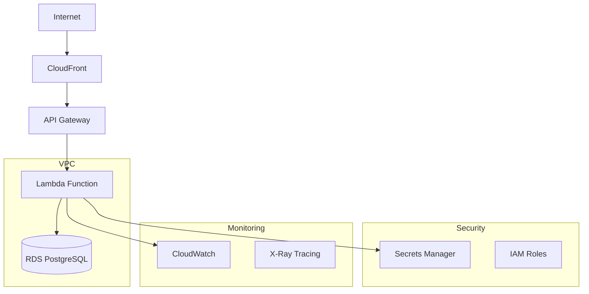

# AWS Deployment Guide - Task Management Application

## Overview
This guide covers the complete AWS infrastructure setup and deployment process for the task management application, including RDS PostgreSQL, Lambda functions, API Gateway, and monitoring.

## Prerequisites

### Required Tools
- AWS CLI v2 installed and configured
- .NET 8 SDK
- Docker (for Lambda container deployment)
- AWS SAM CLI (optional, for local testing)

### AWS Account Setup
- AWS account with appropriate permissions
- IAM user with programmatic access
- AWS CLI configured with credentials

## AWS Services Architecture



## Phase 1: Database Setup (RDS PostgreSQL)

### 1.1 Create RDS Subnet Group
```bash
aws rds create-db-subnet-group \
    --db-subnet-group-name taskmanager-subnet-group \
    --db-subnet-group-description "Subnet group for TaskManager RDS" \
    --subnet-ids subnet-12345678 subnet-87654321 \
    --tags Key=Project,Value=TaskManager
```

### 1.2 Create Security Group for RDS
```bash
aws ec2 create-security-group \
    --group-name taskmanager-rds-sg \
    --description "Security group for TaskManager RDS PostgreSQL" \
    --vpc-id vpc-12345678

# Allow PostgreSQL access from Lambda security group
aws ec2 authorize-security-group-ingress \
    --group-id sg-rds-12345678 \
    --protocol tcp \
    --port 5432 \
    --source-group sg-lambda-12345678
```

### 1.3 Create RDS PostgreSQL Instance
```bash
aws rds create-db-instance \
    --db-instance-identifier taskmanager-db \
    --db-instance-class db.t3.micro \
    --engine postgres \
    --engine-version 15.4 \
    --master-username taskmanager_admin \
    --master-user-password "YourSecurePassword123!" \
    --allocated-storage 20 \
    --storage-type gp2 \
    --vpc-security-group-ids sg-rds-12345678 \
    --db-subnet-group-name taskmanager-subnet-group \
    --backup-retention-period 7 \
    --storage-encrypted \
    --tags Key=Project,Value=TaskManager
```

### 1.4 Store Database Credentials in Secrets Manager
```bash
aws secretsmanager create-secret \
    --name "taskmanager/database" \
    --description "Database credentials for TaskManager" \
    --secret-string '{
        "username": "taskmanager_admin",
        "password": "YourSecurePassword123!",
        "engine": "postgres",
        "host": "taskmanager-db.cluster-xyz.us-east-1.rds.amazonaws.com",
        "port": 5432,
        "dbname": "taskmanager"
    }'
```

## Phase 2: Lambda Function Setup

### 2.1 Create IAM Role for Lambda
```json
{
    "Version": "2012-10-17",
    "Statement": [
        {
            "Effect": "Allow",
            "Principal": {
                "Service": "lambda.amazonaws.com"
            },
            "Action": "sts:AssumeRole"
        }
    ]
}
```

### 2.2 Create Lambda Execution Policy
```json
{
    "Version": "2012-10-17",
    "Statement": [
        {
            "Effect": "Allow",
            "Action": [
                "logs:CreateLogGroup",
                "logs:CreateLogStream",
                "logs:PutLogEvents"
            ],
            "Resource": "arn:aws:logs:*:*:*"
        },
        {
            "Effect": "Allow",
            "Action": [
                "secretsmanager:GetSecretValue"
            ],
            "Resource": "arn:aws:secretsmanager:*:*:secret:taskmanager/*"
        },
        {
            "Effect": "Allow",
            "Action": [
                "ec2:CreateNetworkInterface",
                "ec2:DescribeNetworkInterfaces",
                "ec2:DeleteNetworkInterface"
            ],
            "Resource": "*"
        }
    ]
}
```

### 2.3 Lambda Deployment Package Structure
```
deployment-package/
├── TaskManager.Api.dll
├── TaskManager.Data.dll
├── TaskManager.Shared.dll
├── bootstrap (for custom runtime)
├── appsettings.json
└── dependencies/
    ├── Npgsql.dll
    ├── Microsoft.EntityFrameworkCore.dll
    └── [other dependencies]
```

### 2.4 Create Lambda Function
```bash
aws lambda create-function \
    --function-name TaskManagerApi \
    --runtime dotnet8 \
    --role arn:aws:iam::123456789012:role/TaskManagerLambdaRole \
    --handler TaskManager.Api::TaskManager.Api.LambdaEntryPoint::FunctionHandlerAsync \
    --zip-file fileb://deployment-package.zip \
    --timeout 30 \
    --memory-size 512 \
    --environment Variables='{
        "ASPNETCORE_ENVIRONMENT": "Production",
        "ConnectionStrings__DefaultConnection": "Host=taskmanager-db.cluster-xyz.us-east-1.rds.amazonaws.com;Database=taskmanager;Username=taskmanager_admin;Password=YourSecurePassword123!",
        "Authentication__Google__ClientId": "your-google-client-id",
        "Authentication__Google__ClientSecret": "your-google-client-secret"
    }' \
    --vpc-config SubnetIds=subnet-12345678,subnet-87654321,SecurityGroupIds=sg-lambda-12345678
```

## Phase 3: API Gateway Setup

### 3.1 Create HTTP API
```bash
aws apigatewayv2 create-api \
    --name TaskManagerApi \
    --protocol-type HTTP \
    --description "API Gateway for TaskManager application" \
    --cors-configuration AllowCredentials=true,AllowHeaders="*",AllowMethods="*",AllowOrigins="*"
```

### 3.2 Create Lambda Integration
```bash
aws apigatewayv2 create-integration \
    --api-id abcdef123 \
    --integration-type AWS_PROXY \
    --integration-uri arn:aws:lambda:us-east-1:123456789012:function:TaskManagerApi \
    --payload-format-version 2.0
```

### 3.3 Create Routes
```bash
# Catch-all route for the API
aws apigatewayv2 create-route \
    --api-id abcdef123 \
    --route-key 'ANY /{proxy+}' \
    --target integrations/xyz789

# Default route
aws apigatewayv2 create-route \
    --api-id abcdef123 \
    --route-key '$default' \
    --target integrations/xyz789
```

### 3.4 Create and Deploy Stage
```bash
aws apigatewayv2 create-stage \
    --api-id abcdef123 \
    --stage-name prod \
    --auto-deploy
```

## Phase 4: CloudFormation Template

### 4.1 Complete Infrastructure Template
```yaml
AWSTemplateFormatVersion: '2010-09-09'
Description: 'TaskManager Application Infrastructure'

Parameters:
  Environment:
    Type: String
    Default: prod
    AllowedValues: [dev, staging, prod]
  
  DatabasePassword:
    Type: String
    NoEcho: true
    Description: 'Password for the RDS PostgreSQL database'

Resources:
  # VPC and Networking
  TaskManagerVPC:
    Type: AWS::EC2::VPC
    Properties:
      CidrBlock: 10.0.0.0/16
      EnableDnsHostnames: true
      EnableDnsSupport: true
      Tags:
        - Key: Name
          Value: !Sub 'TaskManager-VPC-${Environment}'

  PrivateSubnet1:
    Type: AWS::EC2::Subnet
    Properties:
      VpcId: !Ref TaskManagerVPC
      CidrBlock: 10.0.1.0/24
      AvailabilityZone: !Select [0, !GetAZs '']
      Tags:
        - Key: Name
          Value: !Sub 'TaskManager-Private-Subnet-1-${Environment}'

  PrivateSubnet2:
    Type: AWS::EC2::Subnet
    Properties:
      VpcId: !Ref TaskManagerVPC
      CidrBlock: 10.0.2.0/24
      AvailabilityZone: !Select [1, !GetAZs '']
      Tags:
        - Key: Name
          Value: !Sub 'TaskManager-Private-Subnet-2-${Environment}'

  # Security Groups
  RDSSecurityGroup:
    Type: AWS::EC2::SecurityGroup
    Properties:
      GroupDescription: Security group for RDS PostgreSQL
      VpcId: !Ref TaskManagerVPC
      SecurityGroupIngress:
        - IpProtocol: tcp
          FromPort: 5432
          ToPort: 5432
          SourceSecurityGroupId: !Ref LambdaSecurityGroup

  LambdaSecurityGroup:
    Type: AWS::EC2::SecurityGroup
    Properties:
      GroupDescription: Security group for Lambda function
      VpcId: !Ref TaskManagerVPC
      SecurityGroupEgress:
        - IpProtocol: -1
          CidrIp: 0.0.0.0/0

  # RDS Database
  DBSubnetGroup:
    Type: AWS::RDS::DBSubnetGroup
    Properties:
      DBSubnetGroupDescription: Subnet group for TaskManager RDS
      SubnetIds:
        - !Ref PrivateSubnet1
        - !Ref PrivateSubnet2
      Tags:
        - Key: Name
          Value: !Sub 'TaskManager-DB-SubnetGroup-${Environment}'

  TaskManagerDatabase:
    Type: AWS::RDS::DBInstance
    Properties:
      DBInstanceIdentifier: !Sub 'taskmanager-db-${Environment}'
      DBInstanceClass: db.t3.micro
      Engine: postgres
      EngineVersion: '15.4'
      MasterUsername: taskmanager_admin
      MasterUserPassword: !Ref DatabasePassword
      AllocatedStorage: 20
      StorageType: gp2
      VPCSecurityGroups:
        - !Ref RDSSecurityGroup
      DBSubnetGroupName: !Ref DBSubnetGroup
      BackupRetentionPeriod: 7
      StorageEncrypted: true
      DeletionProtection: false

  # Secrets Manager
  DatabaseSecret:
    Type: AWS::SecretsManager::Secret
    Properties:
      Name: !Sub 'taskmanager/database/${Environment}'
      Description: Database credentials for TaskManager
      SecretString: !Sub |
        {
          "username": "taskmanager_admin",
          "password": "${DatabasePassword}",
          "engine": "postgres",
          "host": "${TaskManagerDatabase.Endpoint.Address}",
          "port": 5432,
          "dbname": "taskmanager"
        }

  # Lambda Function
  LambdaExecutionRole:
    Type: AWS::IAM::Role
    Properties:
      AssumeRolePolicyDocument:
        Version: '2012-10-17'
        Statement:
          - Effect: Allow
            Principal:
              Service: lambda.amazonaws.com
            Action: sts:AssumeRole
      ManagedPolicyArns:
        - arn:aws:iam::aws:policy/service-role/AWSLambdaVPCAccessExecutionRole
      Policies:
        - PolicyName: SecretsManagerAccess
          PolicyDocument:
            Version: '2012-10-17'
            Statement:
              - Effect: Allow
                Action:
                  - secretsmanager:GetSecretValue
                Resource: !Ref DatabaseSecret

  TaskManagerLambda:
    Type: AWS::Lambda::Function
    Properties:
      FunctionName: !Sub 'TaskManagerApi-${Environment}'
      Runtime: dotnet8
      Handler: TaskManager.Api::TaskManager.Api.LambdaEntryPoint::FunctionHandlerAsync
      Role: !GetAtt LambdaExecutionRole.Arn
      Code:
        ZipFile: |
          // Placeholder - replace with actual deployment package
      Timeout: 30
      MemorySize: 512
      Environment:
        Variables:
          ASPNETCORE_ENVIRONMENT: !Ref Environment
          DATABASE_SECRET_NAME: !Ref DatabaseSecret
      VpcConfig:
        SecurityGroupIds:
          - !Ref LambdaSecurityGroup
        SubnetIds:
          - !Ref PrivateSubnet1
          - !Ref PrivateSubnet2

  # API Gateway
  TaskManagerApi:
    Type: AWS::ApiGatewayV2::Api
    Properties:
      Name: !Sub 'TaskManagerApi-${Environment}'
      ProtocolType: HTTP
      Description: API Gateway for TaskManager application
      CorsConfiguration:
        AllowCredentials: true
        AllowHeaders:
          - '*'
        AllowMethods:
          - '*'
        AllowOrigins:
          - '*'

  LambdaIntegration:
    Type: AWS::ApiGatewayV2::Integration
    Properties:
      ApiId: !Ref TaskManagerApi
      IntegrationType: AWS_PROXY
      IntegrationUri: !Sub 'arn:aws:lambda:${AWS::Region}:${AWS::AccountId}:function:${TaskManagerLambda}'
      PayloadFormatVersion: '2.0'

  DefaultRoute:
    Type: AWS::ApiGatewayV2::Route
    Properties:
      ApiId: !Ref TaskManagerApi
      RouteKey: '$default'
      Target: !Sub 'integrations/${LambdaIntegration}'

  ProxyRoute:
    Type: AWS::ApiGatewayV2::Route
    Properties:
      ApiId: !Ref TaskManagerApi
      RouteKey: 'ANY /{proxy+}'
      Target: !Sub 'integrations/${LambdaIntegration}'

  ApiStage:
    Type: AWS::ApiGatewayV2::Stage
    Properties:
      ApiId: !Ref TaskManagerApi
      StageName: !Ref Environment
      AutoDeploy: true

  # Lambda Permission for API Gateway
  LambdaApiGatewayPermission:
    Type: AWS::Lambda::Permission
    Properties:
      FunctionName: !Ref TaskManagerLambda
      Action: lambda:InvokeFunction
      Principal: apigateway.amazonaws.com
      SourceArn: !Sub '${TaskManagerApi}/*/*'

Outputs:
  ApiEndpoint:
    Description: 'API Gateway endpoint URL'
    Value: !Sub 'https://${TaskManagerApi}.execute-api.${AWS::Region}.amazonaws.com/${Environment}'
    Export:
      Name: !Sub '${AWS::StackName}-ApiEndpoint'

  DatabaseEndpoint:
    Description: 'RDS PostgreSQL endpoint'
    Value: !GetAtt TaskManagerDatabase.Endpoint.Address
    Export:
      Name: !Sub '${AWS::StackName}-DatabaseEndpoint'
```

## Phase 5: Deployment Scripts

### 5.1 Build and Package Script
```bash
#!/bin/bash
# build-and-package.sh

set -e

echo "Building .NET application..."
dotnet publish src/TaskManager.Api/TaskManager.Api.csproj \
    -c Release \
    -r linux-x64 \
    --self-contained false \
    -o publish/

echo "Creating deployment package..."
cd publish/
zip -r ../deployment-package.zip .
cd ..

echo "Deployment package created: deployment-package.zip"
```

### 5.2 Deploy Script
```bash
#!/bin/bash
# deploy.sh

set -e

ENVIRONMENT=${1:-prod}
STACK_NAME="taskmanager-${ENVIRONMENT}"

echo "Deploying TaskManager to ${ENVIRONMENT} environment..."

# Build and package
./build-and-package.sh

# Deploy CloudFormation stack
aws cloudformation deploy \
    --template-file infrastructure/cloudformation.yaml \
    --stack-name ${STACK_NAME} \
    --parameter-overrides Environment=${ENVIRONMENT} \
    --capabilities CAPABILITY_IAM \
    --region us-east-1

# Update Lambda function code
aws lambda update-function-code \
    --function-name TaskManagerApi-${ENVIRONMENT} \
    --zip-file fileb://deployment-package.zip

echo "Deployment completed successfully!"
echo "API Endpoint: $(aws cloudformation describe-stacks --stack-name ${STACK_NAME} --query 'Stacks[0].Outputs[?OutputKey==`ApiEndpoint`].OutputValue' --output text)"
```

## Phase 6: Monitoring and Logging

### 6.1 CloudWatch Log Groups
```bash
aws logs create-log-group \
    --log-group-name /aws/lambda/TaskManagerApi-prod

aws logs put-retention-policy \
    --log-group-name /aws/lambda/TaskManagerApi-prod \
    --retention-in-days 30
```

### 6.2 CloudWatch Alarms
```bash
# Lambda Error Rate Alarm
aws cloudwatch put-metric-alarm \
    --alarm-name "TaskManager-Lambda-ErrorRate" \
    --alarm-description "Lambda function error rate" \
    --metric-name Errors \
    --namespace AWS/Lambda \
    --statistic Sum \
    --period 300 \
    --threshold 5 \
    --comparison-operator GreaterThanThreshold \
    --dimensions Name=FunctionName,Value=TaskManagerApi-prod \
    --evaluation-periods 2

# RDS CPU Utilization Alarm
aws cloudwatch put-metric-alarm \
    --alarm-name "TaskManager-RDS-CPUUtilization" \
    --alarm-description "RDS CPU utilization" \
    --metric-name CPUUtilization \
    --namespace AWS/RDS \
    --statistic Average \
    --period 300 \
    --threshold 80 \
    --comparison-operator GreaterThanThreshold \
    --dimensions Name=DBInstanceIdentifier,Value=taskmanager-db-prod \
    --evaluation-periods 2
```

## Phase 7: Security Best Practices

### 7.1 Environment Variables Security
- Use AWS Secrets Manager for sensitive data
- Encrypt environment variables at rest
- Use IAM roles instead of access keys
- Implement least privilege access

### 7.2 Network Security
- Deploy Lambda in private subnets
- Use security groups to restrict access
- Enable VPC Flow Logs for monitoring
- Consider using AWS WAF for API protection

### 7.3 Database Security
- Enable encryption at rest and in transit
- Use strong passwords stored in Secrets Manager
- Implement regular automated backups
- Monitor database access logs

## Troubleshooting Guide

### Common Issues

1. **Lambda Cold Starts**
   - Increase memory allocation
   - Implement connection pooling
   - Use provisioned concurrency for critical functions

2. **Database Connection Issues**
   - Verify security group rules
   - Check VPC configuration
   - Validate connection strings
   - Monitor connection pool usage

3. **API Gateway Timeouts**
   - Increase Lambda timeout settings
   - Optimize database queries
   - Implement proper error handling
   - Use async/await patterns

4. **Authentication Problems**
   - Verify Google OAuth configuration
   - Check redirect URIs
   - Validate JWT token handling
   - Monitor authentication logs

This deployment guide provides a comprehensive approach to setting up your TaskManager application on AWS with proper security, monitoring, and scalability considerations.