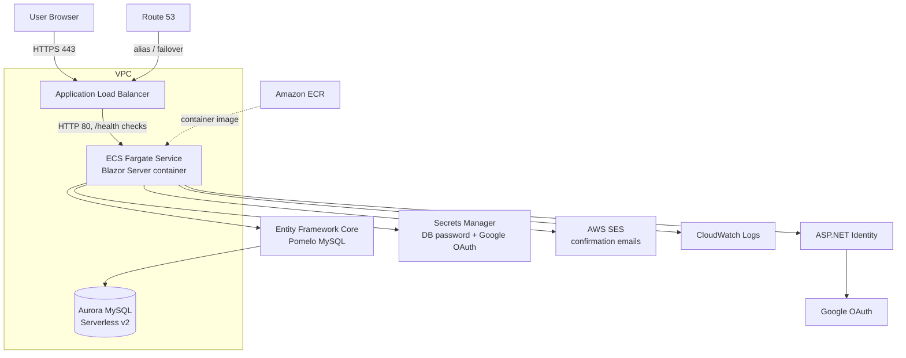

# Task Management Web Application — Architecture

> Authoritative sources: [CLAUDE.md](../../CLAUDE.md), the templates under
> [infrastructure/](../../infrastructure/), and the deploy workflow
> [.github/workflows/zbuild.yml](../../.github/workflows/zbuild.yml). Where this
> document and those disagree, trust the code.

## Overview

A full-stack task/project management web application built on **.NET 10
(`net10.0`)**. The deployed surface is a **Blazor Server** web app running as a
**Docker container on ECS Fargate behind an Application Load Balancer (ALB)**,
backed by **Aurora MySQL Serverless v2**, with authentication via **ASP.NET Core
Identity + Google OAuth**.

> This app is **not** AWS Lambda + API Gateway, and the database is **not**
> PostgreSQL/RDS. `Tjb.Api` retains some vestigial Lambda hosting glue but is not
> the deployed front door.

## Technology stack

- **Runtime / framework**: .NET 10 (`net10.0`), ASP.NET Core. CI uses
  `dotnet-version: 10.0.x`.
- **Frontend**: Blazor Server + Razor Pages, served by `Tjb.Web`.
- **Auth**: ASP.NET Core Identity (Identity tables live in the same database) +
  Google OAuth (`/signin-google` callback).
- **Database**: Aurora MySQL Serverless v2 via
  `Pomelo.EntityFrameworkCore.MySql` (`UseMySql`), port `3306`, engine
  `8.0.mysql_aurora.3.10.0`. ORM is Entity Framework Core.
- **Hosting**: Docker image (`mcr.microsoft.com/dotnet/aspnet:10.0`) →
  Amazon ECR → ECS Fargate → ALB (HTTPS via ACM cert, HTTP→HTTPS redirect).
- **Infrastructure as code**: AWS SAM-packaged, nested CloudFormation templates
  under `infrastructure/`, deployed by GitHub Actions.

## System architecture



Request flow: clients hit `https://{branch-leaf}.{DOMAIN_NAME}` (e.g.
`https://app.appcloud.systems`). The ALB terminates TLS with an ACM certificate,
redirects HTTP→HTTPS, and forwards to the Fargate task on container port 80. The
ALB health check targets `/health` (excluded from auth). The container reads
`X-Forwarded-Proto`/`-For` (forwarded-headers config in
[src/Tjb.Web/Program.cs](../Tjb.Web/Program.cs)) so the Google OAuth callback
sees HTTPS.

## Solution projects

Six projects in [Tjb.sln](../../Tjb.sln):

| Project | Role |
|---|---|
| **Tjb.Web** | **The deployed application.** Blazor Server + Razor Pages + ASP.NET Identity + Google OAuth. Containerized via [src/Tjb.Web/Dockerfile](../Tjb.Web/Dockerfile). Applies migrations on startup (`EnsureCreatedAsync` then `MigrateAsync`, exceptions swallowed so the app still boots). |
| **Tjb.Api** | Minimal Web API; effectively secondary/vestigial. Exposes `/health`, Swagger (dev), and stub `AuthController` endpoints. Still contains Lambda hosting glue but is **not** the deployed surface. |
| **Tjb.Data** | EF Core `TjbDbContext` (extends `IdentityDbContext<IdentityUser>`), entities, and configurations. `MigrationsAssembly` is `Tjb.Migrations` — migrations are **not** generated here. |
| **Tjb.Migrations** | Holds EF migration files, an `IDesignTimeDbContextFactory`, and a standalone `Program.cs` that applies migrations + seeds. Referenced by `Api`/`Web` for startup migration. |
| **Tjb.Shared** | DTOs and enums (`TaskStatus`, `TaskPriority`, `ProjectRole`). Packed as a NuGet on every CI build. |
| **Tjb.UiTests** | Playwright + xUnit. Runs against a *deployed* URL (`TEST_BASE_URL`), using token-based Google auth in CI. |

## Data layer

- `TjbDbContext` extends `IdentityDbContext<IdentityUser>`, so ASP.NET Identity
  tables share the application database.
- Provider: Pomelo MySQL (`UseMySql`), connecting to Aurora MySQL Serverless v2
  on port 3306. The connection string is injected into the container as
  `ConnectionStrings__DefaultConnection` (host/name/user imported from backend
  CloudFormation exports; password resolved from Secrets Manager) — see
  [infrastructure/web.template](../../infrastructure/web.template).
- Migrations live in `Tjb.Migrations`. Generate with
  `--project src/Tjb.Migrations --startup-project src/Tjb.Migrations`.

## Authentication

All real authentication is in `Tjb.Web`: ASP.NET Core Identity plus Google
OAuth. The Google client ID/secret reach the container as
`Authentication__Google__ClientId` / `__ClientSecret`, resolved from Secrets
Manager (`{dashed-domain}/google-oauth/{branch}`). `Tjb.Api`'s `AuthController`
is intentionally a no-op.

## Infrastructure (SAM-packaged nested CloudFormation)

The running system is provisioned entirely from the templates in
[infrastructure/](../../infrastructure/), deployed via AWS SAM + CloudFormation
by [zbuild.yml](../../.github/workflows/zbuild.yml). The env stack is a tree of
nested stacks:

```
master.template
├── backend.template
│   ├── security.template        # SharedLambdaExecutionRole (assumed by ECS tasks; includes SES access)
│   ├── network.template         # VPC, public/private subnets, ALB/ECS/Lambda security groups, flow logs
│   ├── db.template              # Aurora MySQL Serverless v2 cluster (+ Global Cluster on app/test)
│   └── infrastructure.template  # ECS cluster, Google OAuth secret
└── application.template
    ├── api.template             # (regional API resources)
    ├── web.template             # ALB + listeners + ACM cert + ECS Fargate task definition & service
    └── dns.template             # Route 53 records / health checks (deployed once per env)
```

- **Shared-infrastructure branches** (`app`, `test`, `dev`) deploy
  `master.template` (full backend incl. Aurora). `dev` is single-region;
  `app`/`test` are multi-region (Aurora Global Cluster).
- **Every other branch** (`{type}/{name}` feature branches) deploys
  `application.template` only, importing backend exports from `dev` via
  `Fn::ImportValue`.
- The bootstrap stack (one per region, named for the dashed domain) owns the ECR
  repository, the templates S3 bucket, KMS keys, and the GitHub Actions IAM
  users — see the "Infrastructure naming convention" section of CLAUDE.md.

## Hosting details (from web.template)

- **ECS task**: Fargate, `awsvpc` networking, CPU `512` / memory `1024`,
  container `web` listening on port 80, logs to a CloudWatch log group.
- **ALB**: internet-facing; HTTP:80 listener redirects to HTTPS:443; HTTPS:443
  listener forwards to a target group (`TargetType: ip`, health check `/health`).
- **TLS**: ACM certificate for `{branch}.{DomainName}`, DNS-validated in the
  Route 53 hosted zone.
- **DNS / multi-region**: Route 53 alias records (and failover health checks in
  multi-region) point the subdomain at the ALB(s).

## Environment & configuration

- Secrets and connection details come from environment variables / AWS Secrets
  Manager in deployed environments, and from `dotnet user-secrets` locally.
  `appsettings.json` connection strings are localhost defaults only.
- `AwsSes:SenderEmail` is set to `noreply@appcloud.systems` in
  [infrastructure/web.template](../../infrastructure/web.template); confirmation
  emails are sent through AWS SES (see CLAUDE.md "Email" section).

## See also

- [DEPLOYMENT_STRATEGY.md](DEPLOYMENT_STRATEGY.md) — the deployment model.
- [AWS_DEPLOYMENT_GUIDE.md](AWS_DEPLOYMENT_GUIDE.md) — how a push deploys.
- [AWS_DEPLOYMENT_SETUP.md](AWS_DEPLOYMENT_SETUP.md) — secrets/variables/bootstrap setup.
